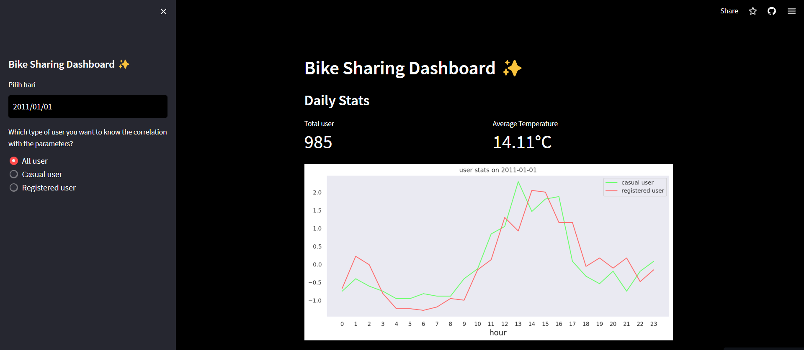

# Dicoding final project submission | Bike Sharing 

## Setup
```
conda create --name dashboard-app python=3.10
conda activate dashboard-app
conda install -c conda-forge jupyterlab
pip install -r requirements.txt
```
## Run dashboard app
```
streamlit run dashboard.py
```

## Deployed dashboard app
link :
https://dashboard-app-tulu0i98emq.streamlit.app/

